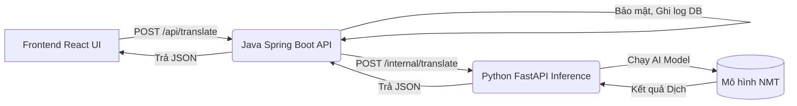

# VN ↔ Ba Na Translator

Dự án ứng dụng web dịch thuật song ngữ **Tiếng Việt ↔ Tiếng Ba Na**. Ứng dụng cung cấp giao diện tương tự Google Dịch, kết hợp với hệ thống Backend RESTful API và một Microservice Inference (chạy mô hình NMT - Neural Machine Translation) để xử lý ngôn ngữ tự nhiên.

---

## 1. Giới thiệu đề tài
Ngôn ngữ Ba Na là một ngôn ngữ dân tộc thiểu số tại Việt Nam. Dự án này được xây dựng nhằm mục đích cung cấp một công cụ dịch máy tự động (Machine Translation) hỗ trợ dịch thuật hai chiều giữa Tiếng Việt và Tiếng Ba Na. Hệ thống không chỉ có chức năng dịch văn bản thông thường mà còn được thiết kế với kiến trúc Microservices linh hoạt, sẵn sàng mở rộng để tích hợp các tính năng nâng cao như nhận dạng chữ qua hình ảnh (OCR), đọc văn bản (Text-to-Speech), và xử lý tài liệu (PDF, Word).

---

## 2. Công nghệ và Thư viện sử dụng

Dự án được chia thành 3 phân hệ chính với các stack công nghệ hiện đại:

### 🌟 Frontend (Giao diện người dùng)
- **Framework & Build tool:** React.js (v19) và Vite, viết bằng TypeScript.
- **Thư viện chính:**
  - `react-simple-keyboard`: Bàn phím ảo hỗ trợ nhập liệu ký tự đặc biệt.
  - `recharts`: Vẽ biểu đồ thống kê (nếu cần).

### ⚙️ Backend API (Gateway & Quản lý nghiệp vụ)
- **Ngôn ngữ:** Java 17.
- **Framework:** Spring Boot 3.3.3.
- **Thư viện và Module:**
  - `Spring Web`: Cung cấp RESTful API.
  - `Spring Security` & `JJWT (JSON Web Token)`: Xác thực và phân quyền người dùng.
  - `Spring Data JPA`: Quản lý truy xuất cơ sở dữ liệu.
  - `MySQL Connector/J`: Kết nối cơ sở dữ liệu MySQL.

### 🧠 Python Inference (Xử lý AI & Model)
- **Ngôn ngữ:** Python 3.10+.
- **Framework:** FastAPI & Uvicorn (phục vụ API hiệu năng cao).
- **Thư viện AI & Xử lý:**
  - `Pydantic`: Validate dữ liệu đầu vào.
  - `gTTS`: Text-to-Speech (Chuyển đổi văn bản thành giọng nói).
  - `pytesseract` & `Pillow`: Nhận dạng ký tự quang học (OCR) từ hình ảnh.
  - `PyMuPDF` & `python-docx`: Đọc và trích xuất văn bản từ tệp PDF và Word.

### 🗄️ Cơ sở dữ liệu
- **Hệ quản trị:** MySQL.

---

## 3. Kiến trúc hệ thống

Hệ thống hoạt động dựa trên mô hình Client-Server kết hợp Microservices. Luồng dữ liệu cho một yêu cầu dịch thuật như sau:



- **Frontend:** Nhận dữ liệu đầu vào từ người dùng (Văn bản, File, Hình ảnh).
- **Java Backend:** Đóng vai trò là API Gateway. Chịu trách nhiệm bảo mật (Authentication/Authorization bằng JWT), ghi log lịch sử dịch vào MySQL, sau đó định tuyến (forward) yêu cầu dịch (chứa text) tới service Python.
- **Python Inference:** Chuyên trách tải và chạy các mô hình Machine Learning / Deep Learning nặng. Sau khi dịch xong, trả kết quả về cho Java.

---

## 4. Cài đặt và Chạy chương trình

### Yêu cầu môi trường (Prerequisites)
- **Node.js** (Phiên bản 18+ khuyến nghị)
- **Java JDK 17+**
- **Maven 3.8+**
- **Python 3.10+**
- **MySQL Server** (Đang chạy local hoặc remote)

### Bước 1: Chuẩn bị Cơ sở dữ liệu
1. Mở MySQL, tạo một database cho ứng dụng.
2. Import file `database.sql` (nếu có) hoặc để Spring Boot tự tạo bảng dựa trên Entity. Cấu hình thông tin kết nối MySQL (username, password, db url) trong file `backend-java/src/main/resources/application.properties`.

### Bước 2: Cài đặt và chạy Python Inference Server
Phân hệ này chạy mô hình dịch thuật. Cần bật nó trước để Java Backend có thể kết nối được.

```powershell
# 1. Di chuyển vào thư mục python-inference
cd python-inference

# 2. Tạo môi trường ảo (Virtual Environment)
python -m venv .venv

# 3. Kích hoạt môi trường ảo (Trên Windows)
.\.venv\Scripts\activate

# 4. Cài đặt các gói phụ thuộc
pip install -r requirements.txt

# 5. Tải model AI (Lưu tất cả model vào thư mục python-inference/models/)
# Link tải: https://drive.google.com/drive/folders/1M5o-T0alc5zGt8IGBH5am4ew7Ej5kxlO?usp=sharing

# 6. Chạy server FastAPI
uvicorn app.main:app --host 127.0.0.1 --port 8001
```
*Ghi chú: Python API sẽ chạy tại `http://127.0.0.1:8001`.*

### Bước 3: Cài đặt và chạy Java Backend (Spring Boot)

```powershell
# 1. Mở terminal mới, di chuyển vào thư mục backend-java
cd backend-java

# 2. Build dự án và tải các thư viện Maven
mvn clean install -DskipTests

# 3. Chạy ứng dụng Spring Boot
mvn spring-boot:run -DskipTests
```
*Ghi chú: Java API sẽ chạy tại `http://127.0.0.1:8080`. Chú ý backend sẽ gọi Python ở `http://localhost:8001` theo cấu hình `python.baseUrl`.*

### Bước 4: Cài đặt và chạy Frontend React

Bạn có thể chạy Frontend độc lập (Dev mode) hoặc Build để tích hợp vào Spring Boot.

**Tùy chọn A: Chạy Development Server (Khuyên dùng khi code Frontend)**
```powershell
# 1. Mở terminal mới, di chuyển vào thư mục frontend
cd frontend

# 2. Cài đặt các gói NPM
npm install

# 3. Chạy Vite Server
npm run dev
```

**Tùy chọn B: Build và tích hợp vào Spring Boot (Production Mode)**
```powershell
cd frontend
npm install
npm run build
```
*Sau khi build, script `postbuild` sẽ tự động copy file từ `frontend/dist` sang thư mục `backend-java/src/main/resources/static/`. Sau đó bạn chỉ cần chạy lại Spring Boot là giao diện sẽ được phục vụ trực tiếp tại `http://127.0.0.1:8080/`.*

---

## 5. Dữ liệu API (Contract)

### Yêu cầu (Request)

```json
POST /api/translate
{
  "text": "Xin chào",
  "sourceLang": "vi",
  "targetLang": "bna"
}
```

### Phản hồi thành công (Response - 200 OK)

```json
{
  "translatedText": "[BaNa-demo] Xin chào",
  "sourceLang": "vi",
  "targetLang": "bna"
}
```

### Lỗi hợp lệ (Error - 400 Validation)

```json
{
  "message": "Validation failed",
  "details": ["text: Text must not be empty."]
}
```

---
*Ghi chú: Hiện tại hàm dịch ở `python-inference/app/inference/translator.py` có thể đang đóng vai trò placeholder, bạn có thể chỉnh sửa hàm này để load và xử lý text bằng model Transformer thật đã được fine-tune.*
